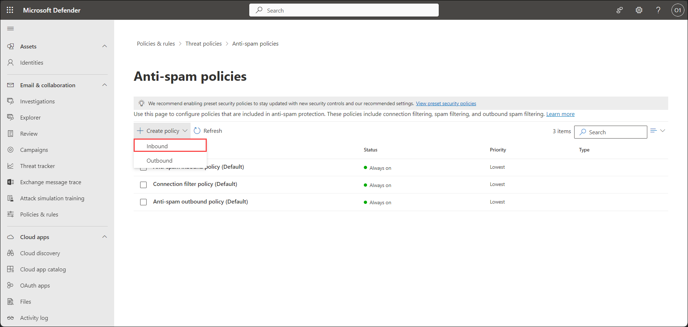
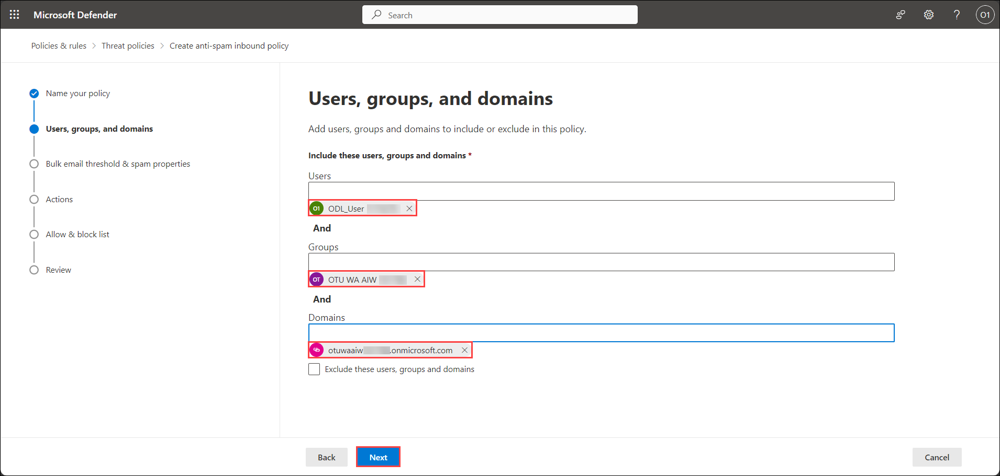
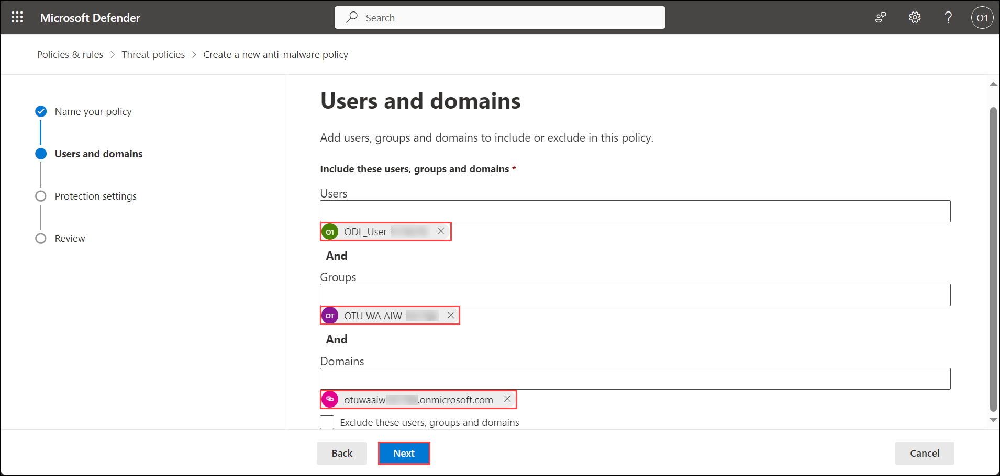
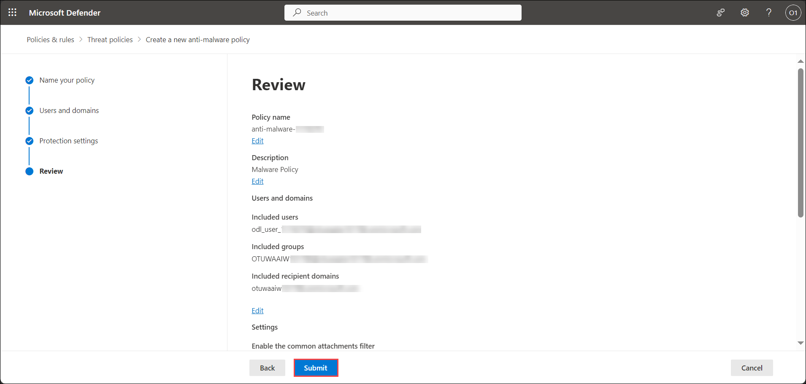
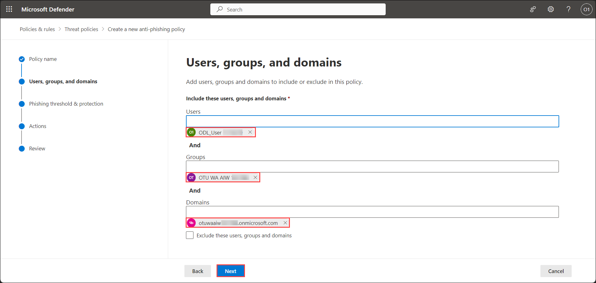

## Lab 03 - Configure Protection Policies (Anti-Spam, Anti-malware and Anti-phishing) 

## Lab scenario

In Microsoft 365 Defender, use Defender for Office 365 to set up Anti-Spam, Anti-Malware, and Anti-Phishing measures. Access the Security & Compliance Center to create policies tailored to detect and manage spam emails, shield against malicious attachments and links, and identify phishing attempts. Configure settings like whitelists, scanning parameters, and URL checks.

## Lab objectives (Duration: minutes)

In this lab, you will complete the following tasks:
- Task 1: Configure Anti-Spam
- Task 2: Configure Anti-malware
- Task 3: Configure Anti-phishing

## Architecture Diagram

## Exercise 1: Configure Protection Policies

### Task 1: Configure Anti-Spam

1. Go to Microsoft Defender Portal at https://security.microsoft.com/.
2. Go to **Settings** > **Email and Collaboration** > **Policies & rules**> Select the **Threat policies**.
   
   

3. Under Policies Select the **Anti-spam**.

   
   
4. Select **Create Policy** > **Inbound**.

   

5. Under Name your policy tab provide **Name** : anti-spam-<inject key="DeploymentID" enableCopy="false" /></inject> and Description: anti-spam and select Next.

   

6. Under Users, groups and domains tab add the Users, groups and domains to be included in the Anti spam policy and select Next.

   

7. Under Bulk email threshold & spam properties tab. Keep the default option selected(If you want to do configurations according to the custom policy. you can add it here). and select Next.

   

8. Under Actons tab. Keep the default option selected and select Next.

   

9. Under Allow & block list tab. Provide the Allowed and Blocked senders and Domains list and select Next.

   

10. Under Review tab. Select Create button.

    

### Task 2: Configure Anti-malware

1. Go to Microsoft Defender Portal at https://security.microsoft.com/.
2. Go to **Settings** > **Email and Collaboration** > **Policies & rules**> Select the **Threat policies**.
   
   

3. Under Policies Select the **Anti-malware**.

   

4. Select **Create** in Anti-malware tab.

   

5. Under Name your policy tab provide **Name** : anti-malware-<inject key="DeploymentID" enableCopy="false" /></inject> and Description: Malware Policy and select Next.

   

6. Under Users and domains tab add the Users, groups and domains to be included in the Anti malware policy and select Next.

   

7. Under Protected settings tab. Keep the default option selected and select Next.

   

8. Under Review tab. Select Create button.

   

### Task 3: Configure Anti-phishing
   
1. Go to Microsoft Defender Portal at https://security.microsoft.com/.
2. Go to **Settings** > **Email and Collaboration** > **Policies & rules**> Select the **Threat policies**.
   
   

3. Under Policies Select the **Anti-phishing**.

4. Under policy name tab provide **Name** : anti-phishing-<inject key="DeploymentID" enableCopy="false" /></inject> and Description: anti phishing and select Next.

   

5. Under Users, groups and domains tab add the Users, groups and domains to be included in the Anti phishing policy and select Next.

   

6. Under Phishing threshold & protection tab add the senders and custom domains as required and select Next.

   

7. Under Review tab. Select Create button.

   

## Review
In this lab, you will complete the following tasks:
- Configure Anti-Spam
- Configure Anti-malware
- Configure Anti-phishing
