## Lab 03 - Configure Protection Policies

## Lab scenario

In this lab, you will Configure Anti-Spam, Anti-Malware, and Anti-Phishing policies in Microsoft Defender for Office 365 involves setting up rules to detect unwanted emails (spam), safeguard against malicious software (malware), and identify and block phishing attempts.

## Lab objectives (Duration: minutes)

In this lab, you will complete the following tasks:
- Exercise 1: Configure Anti-Spam Policy
- Exercise 2: Configure Anti-malware Policy
- Exercise 3: Configure Anti-phishing Policy

## Architecture Diagram

   

### Exercise 1: Configure Anti-Spam Policy

Anti-spam policies serve as the backbone for managing configurable settings related to spam filtering. These policies play a crucial role in filtering both incoming and outgoing emails, employing a diverse range of techniques such as content analysis and sender reputation checks to identify and prevent the transmission of spam. Anti-Spam policies are essential components in safeguarding your email communication against unwanted and potentially harmful spam. By configuring these policies, you gain control over the parameters that dictate how spam is identified and handled within your email environment.

1. Go to Microsoft Defender Portal at https://security.microsoft.com/.
2. Go to **Email and Collaboration** > **Policies & rules**> Select the **Threat policies**.
   
   

3. Under Policies Select the **Anti-spam**.

   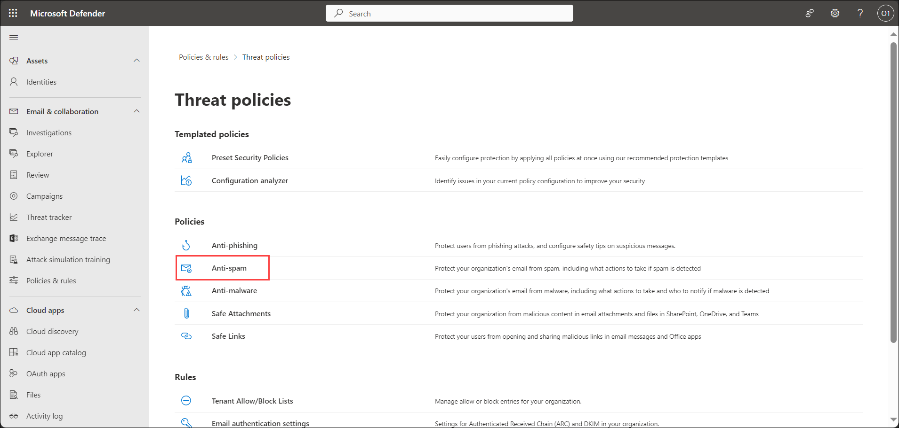
   
4. Select **Create Policy** > **Inbound**.

   

5. Under Name your policy tab provide **Name** : anti-spam and Description: anti-spam and select Next.

   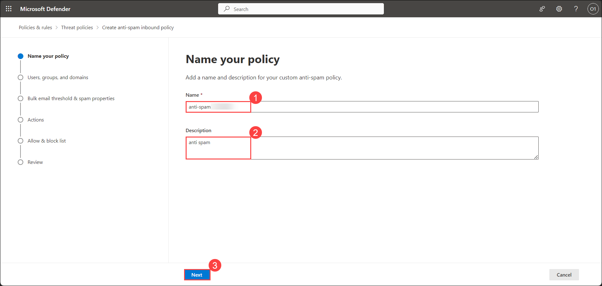

6. Under Users, groups and domains tab you will add the Users, groups and domains to be included in the Anti spam policy as depicted in the screenshot and select Next.

   

>**Note**: As we haven't created any groups so we will be configuring only Users and the domain for now.

7. Under Bulk email threshold & spam properties tab. Keep the default option selected and select Next. (The properties are customizable and can be adjusted to suit specific requirements)

   

8. Under Actons tab. Keep the default option selected and select Next.

   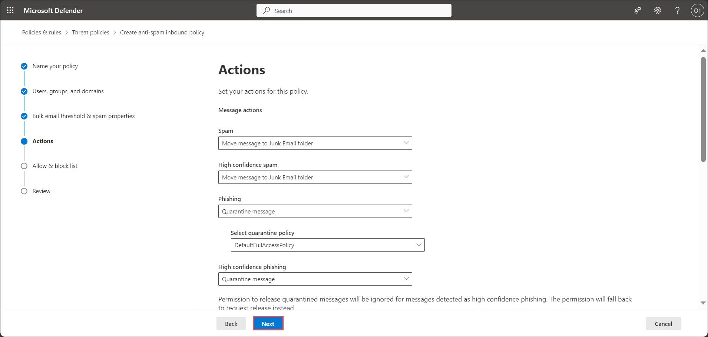

9. Under Allow & block list tab. Provide the Allowed and Blocked senders and Domains list and select Next.

   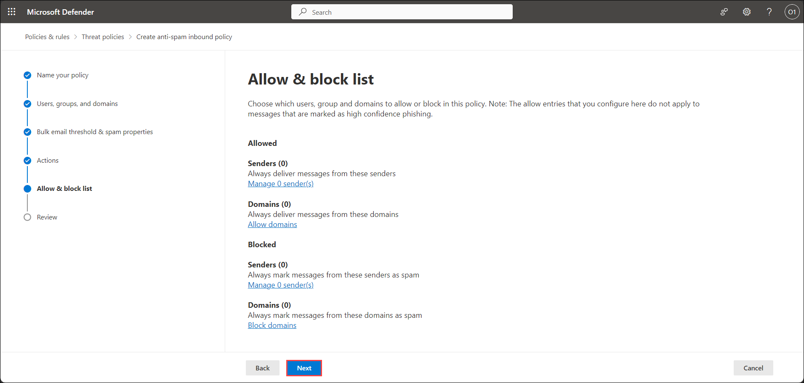

10. Under Review tab. Select Create button.

    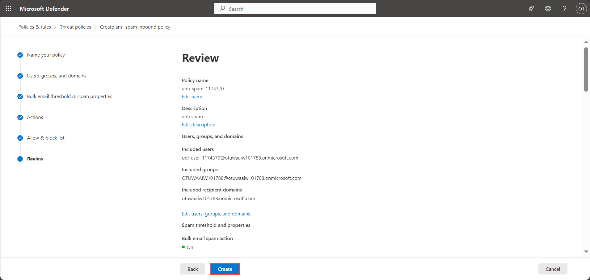

### Exercise 2: Configure Anti-malware Policy

Anti-Malware policies are designed to safeguard against malware, viruses, spyware, and other harmful software that could be transmitted through emails. Anti-Malware policies scan incoming and outgoing emails for malicious content like malware and viruses. They use signature-based and behavior-based detection to identify threats, taking predefined actions upon detection, such as quarantining or deleting malicious attachments or links.

1. Go to Microsoft Defender Portal at https://security.microsoft.com/.
2. Go to **Email and Collaboration** > **Policies & rules**> Select the **Threat policies**.
   
   

3. Under Policies Select the **Anti-malware**.

   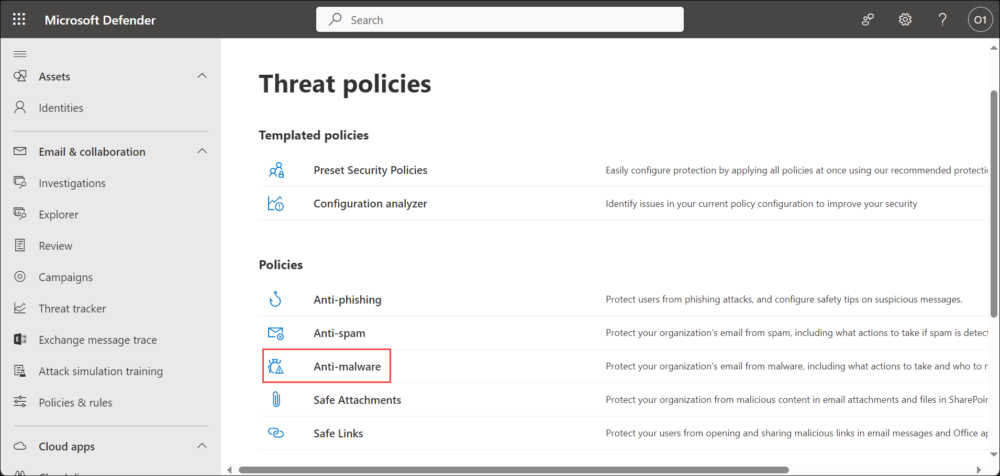

4. Select **Create** in Anti-malware tab.

   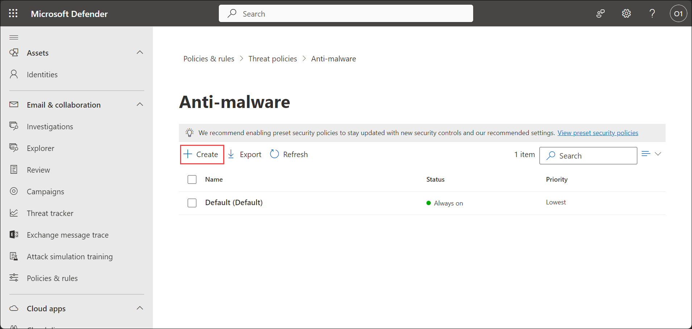

5. Under Name your policy tab provide **Name** : anti-malware and Description: Malware Policy and select Next.

   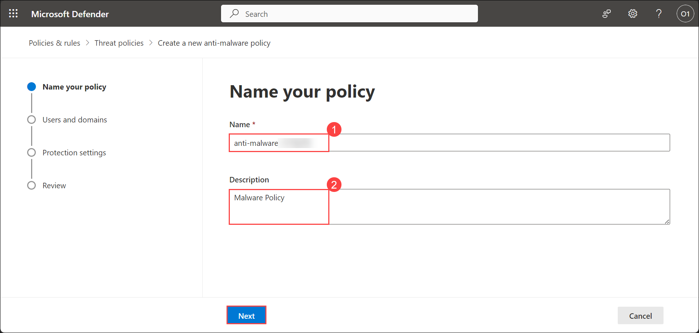

6. Under Users and domains tab add the Users, groups and domains to be included in the Anti malware policy and select Next.

   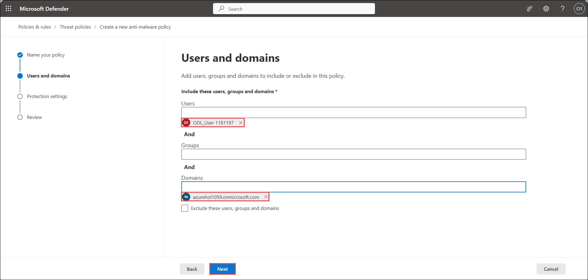

>**Note**: As we haven't created any groups so we will be configuring only Users and the domain for now.

7. Under Protected settings tab. Keep the default options selected and select Next.

   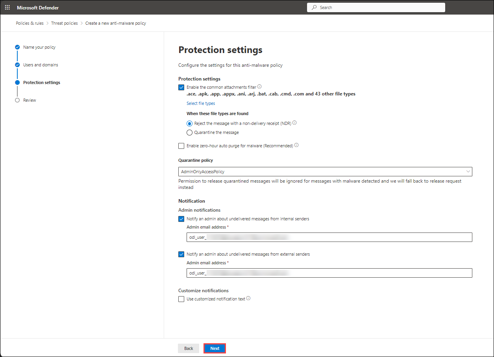

8. Under Review tab. Select Create button.

   

### Exercise 3: Configure Anti-phishing Policy

Anti-phishing in Microsoft Defender for Office 365 is a comprehensive security feature designed to protect against phishing attacks within emails. Anti-phishing feature works by continuously scanning incoming emails in real-time, employing techniques like suspicious URLs and content analysis to detect potential phishing threats.

1. Go to Microsoft Defender Portal at https://security.microsoft.com/.
2. Go to **Email and Collaboration** > **Policies & rules**> Select the **Threat policies**.
   
   

3. Under Policies Select the **Anti-phishing**.

4. Under policy name tab provide **Name** : anti-phishing and Description: anti phishing and select Next.

   

5. Under Users, groups and domains tab add the Users, groups and domains to be included in the Anti phishing policy and select Next.

   

>**Note**: As we haven't created any groups so we will be configuring only Users and the domain for now.

6. Under Phishing threshold & protection tab add the senders and custom domains as required and select Next.

   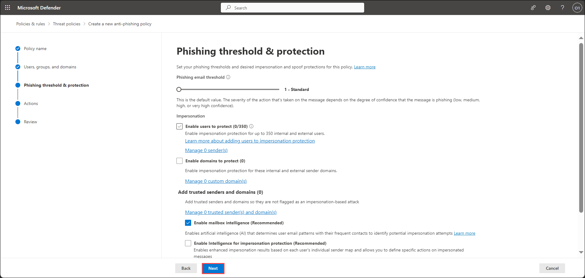

7. Under Review tab. Select Create button.

   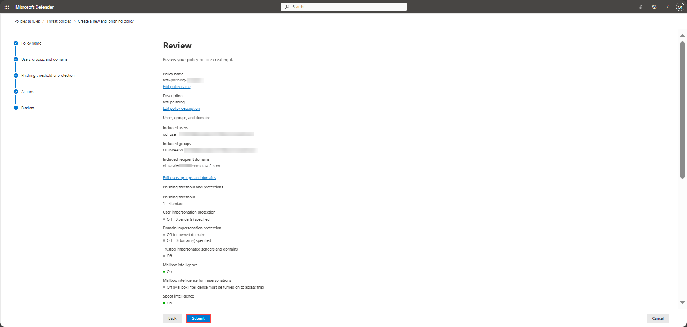

## Review
In this lab, you will complete the following tasks:
- Configure Anti-Spam Policy
- Configure Anti-malware Policy
- Configure Anti-phishing Policy
