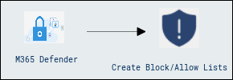
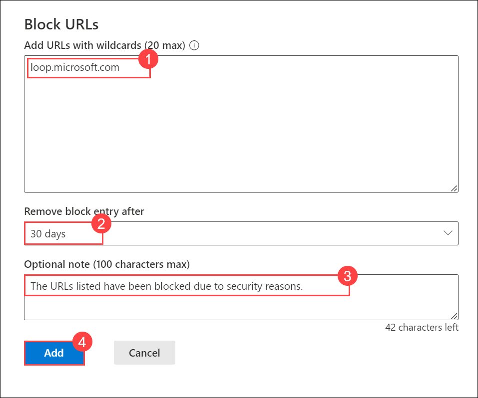
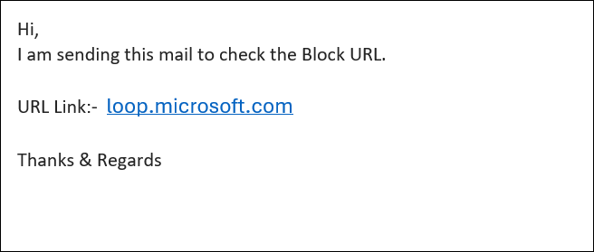
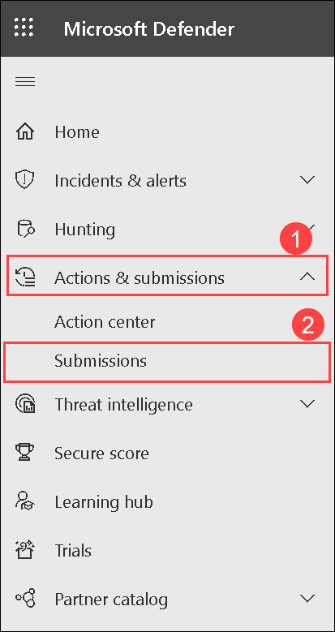

## Lab 05 - Configure Block/Allow Lists

## Lab scenario

This lab focuses on configuring Block and Allow Lists in Microsoft Defender to enhance security measures. The exercises will guide you through the process of creating Block Lists and Allow Lists to manage URLs effectively.

## Lab objectives (Duration: 20 minutes)

In this lab, you will complete the following tasks:
- Exercise 1: Create Block Lists
- Exercise 2: Create Allow Lists

## Architecture Diagram

   

### Exercise 1: Create Block Lists

In this exercise, we will access the Microsoft Defender Portal to create Block Lists. By configuring these lists, we can block specific URLs, using wildcards if needed. This action enhances our organization's security posture by preventing access to URLs that pose potential security threats. The configuration allows us to control and restrict the flow of traffic, ensuring a safer environment for our network and users.

1. Go to Microsoft Defender Portal at https://security.microsoft.com/.

2. Go to **Policies & rules** and click on **Threat Policies**.

   

3. Navigate to **Rules** section, Select **Tenant Allow/Block Lists**.

   

4. Select **URLs** and then Click on **+ Block**.

   

5. In the **Block URLs** flyout that opens, configure the following settings and select **Add**:
   - **Add URLs with wildcards**: loop.microsoft.com.
   - **Remove block entry after**: Select 30 days.
   - **Optional note**: The URLs listed have been blocked due to security reasons.

   

  >**Note**: In the Add URLs with wildcards provide one URL per line, up to a maximum of 20. For details about the syntax for URL entries, see the https://learn.microsoft.com/en-us/microsoft-365/security/office-365-security/tenant-allow-block-list-urls-configure?view=o365-worldwide#url-syntax-for-the-tenant-allowblock-list

7. Back on the **URLs** tab, the entry is listed.

   

1. Once you configure the block URL, you can send a mail to the user using your email ID with the given link: **loop.microsoft.com** in your email. you will find the mail is blocked as you don't received.

   

    >**Note**: You can send another E-mail to ODL User without having the URL Link in them and find ODL user is able to received mail.
### Exercise 2: Create Allow Lists

In this exercise, we will utilize the Microsoft Defender portal to establish Allow Lists. By submitting URLs for Microsoft analysis, we enable the system to recognize and allow specific URLs that are deemed clean. This proactive approach helps in preventing false positives and ensures that legitimate URLs are not inadvertently blocked. Configuring Allow Lists is crucial for maintaining a balance between stringent security measures and allowing essential, trustworthy URLs to function seamlessly within our network.

1. In the Microsoft Defender portal, go to **Actions & submissions > Submissions** Or, go directly to the Submissions page, use [https://security.microsoft.com/reportsubmission](https://security.microsoft.com/reportsubmission)

   

2. On the Submissions page, select the **URLs** tab and On the **URLs** tab, select  **+Submit to Microsoft for analysis**.

   

3. On the **Submit to Microsoft for analysis** flyout that opens, configure the following settings and select **Submit**:
   - **Select the submission type**: URL
   - **URL**: loop.microsoft.com
   - **Why are you submitting this URL to Microsoft**: It appears clean

   

4. Back on the **Submissions** tab, the entry is listed.

   

## Review
In this lab, you will complete the following tasks:
- Created Block List
- Created Allow List
