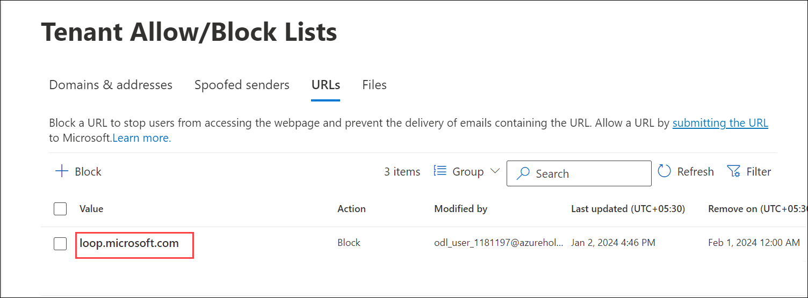
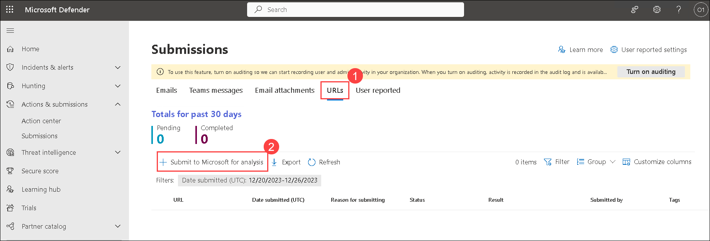
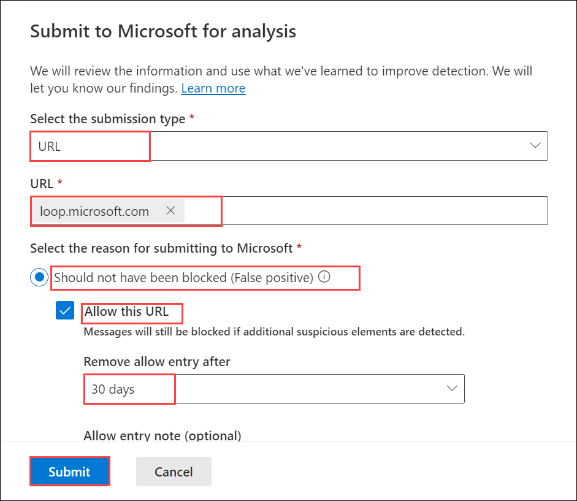

## Lab 05 - Configure Block/Allow Lists

## Lab scenario

Configuring Block/Allow Lists within the Microsoft 365 Defender suite involves managing lists of allowed and blocked entities, such as email addresses, domains, or specific file types, to control what enters or leaves an organization's environment.
The Tenant Allow/Block List in the Microsoft Defender portal gives you a way to manually override the Defender for Office 365. The list is used during mail flow for incoming messages from external senders. It apply to internal messages within the organization. However, block entries prevent users in the organization.

## Lab objectives (Duration: minutes)

In this lab, you will complete the following tasks:
- Exercise 1: Create Block Lists
- Exercise 2: Create Allow Lists

## Architecture Diagram

### Exercise 1: Create Block Lists

1. Go to Microsoft Defender Portal at https://security.microsoft.com/.

2. Go to **Policies & rules** and Click on **Threat Policies**.

   

3. Navigate to **Rules** section, Select **Tenant Allow/Block Lists**.

   

4. Select **URLs** and then Click on **+ Block**.

   

5. In the **Block URLs** flyout that opens, configure the following settings and select **Add**:
   - **Add URLs with wildcards**: **contoso.com/***.
   - **Remove block entry after**: Select 30 days.
   - **Optional note**: The URLs listed have been blocked due to security reasons.

   

  >**Note**: In the Add URLs with wildcards provide one URL per line, up to a maximum of 20. For details about the syntax for URL entries, see the https://learn.microsoft.com/en-us/microsoft-365/security/office-365-security/tenant-allow-block-list-urls-configure?view=o365-worldwide#url-syntax-for-the-tenant-allowblock-list

7. Back on the **URLs** tab, the entry is listed.

   

1. Once you configure the block URL, you send a mail to the user using your email ID with the given link: **contoso.com** in your email. They will find the mail is blocked.

### Exercise 2: Create Allow Lists

1. In the Microsoft Defender portal, go to **Actions & submissions > Submissions** Or, go directly to the Submissions page, use [https://security.microsoft.com/reportsubmission](https://security.microsoft.com/reportsubmission)

   

2. On the Submissions page, select the **URLs** tab and On the **URLs** tab, select  **+Submit to Microsoft for analysis**.

   

3. On the **Submit to Microsoft for analysis** flyout that opens, configure the following settings and select **Submit**:
   - **Select the submission type**: URL
   - **URL**: contoso.com/*
   - **Why are you submitting this URL to Microsoft**: It appears clean

   

4. Back on the **Submissions** tab, the entry is listed.

   

## Review
In this lab, you will complete the following tasks:
- Create Block List.
- Create Allow List.
