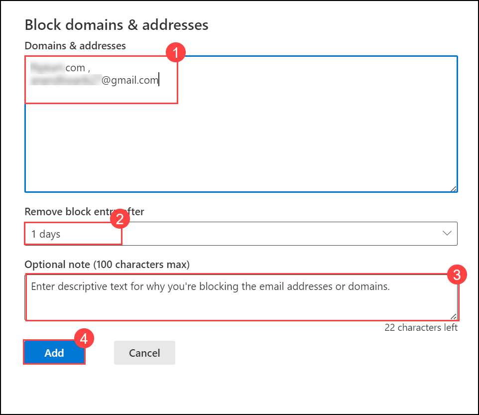
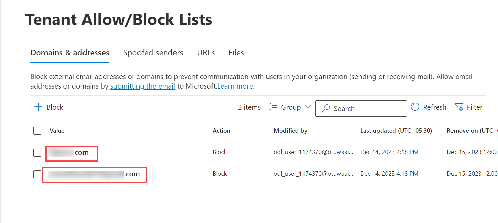

## Lab 05 - Configure Block/Allow Lists

## Lab scenario

Configuring Block/Allow Lists within the Microsoft 365 Defender suite involves managing lists of allowed and blocked entities, such as email addresses, domains, or specific file types, to control what enters or leaves an organization's environment.

## Lab objectives (Duration: minutes)

In this lab, you will complete the following tasks:
- Task 1: Create Block Entries

## Architecture Diagram

### Task 1: Create Block Entries

1. Go to Microsoft Defender Portal at https://security.microsoft.com/.

1. Go to **Policies & rules** and Click on **Threat Policies**.

   

1. Navigate to **Rules** section, Select **Tenant Allow/Block Lists**.

   

1. Click on **+ Block**.

   

1. In the **Block domains & addresses** flyout that opens, configure the following settings:
   - **Domains & addresses**: Enter one email address or domain per line, up to a maximum of 20.
   - **Remove block entry after**: Select 1 days.
   - **Optional note**: you can optional note here.

1. When you're finished in the Block domains & addresses flyout, select **Add**.

   

1. Back on the **Domains & email addresses** tab, the entry is listed.

   

## Review
In this lab, you will complete the following tasks:
- Create Block Entries.
