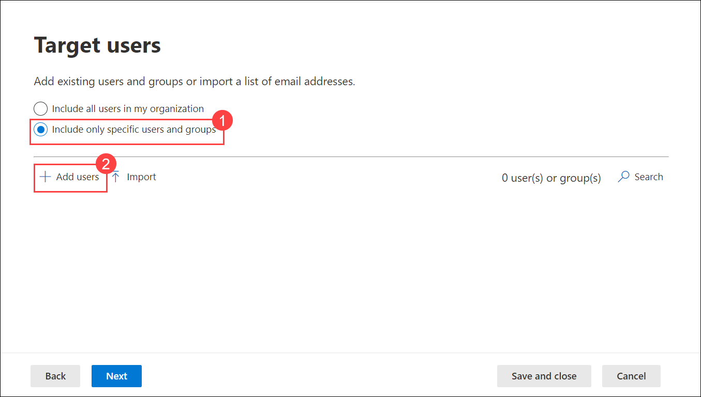

## Lab 06 - Launch phishing simulation campaigns. 

## Lab scenario
In this lab you will explore about the *Microsoft Defender Portal*.

## Lab objectives (Duration: minutes)

In this lab, you will complete the following tasks:
- Task 1: Simulate a Pishing Attack.

## Architecture Diagram

### Task 1: Simulate a Pishing Attack.

1. Go to Microsoft Defender portal at https://security.microsoft.com.

1. Go to **Email & collaboration** > **Attack simulation training** > **Simulations** tab and Click on **Launch a Simulation**.

      
   
1. On the **Select technique** page, select **Credential Harvest** and Click on **Next**.

      
   
1. On the Name simulation page, configure the following settings:

   - **Name**: Enter a unique, descriptive name (**Creadentials_Simulation**) for the simulation.
   - **Description**: Enter an optional detailed description for the simulation.
When you're finished on the Name simulation page, select **Next**.

      

1. On the **Select payload and login page** page, you need to select **Microsoft Account Password Reset** and Click on **Next**.

      

1.  On the **Target users** screen, Select **Include only specific users and groups** and Click **Add users**.

      

1.  Select for your user, Click on **Add 1 User(s)**.

      

1. Click on **Next**.

      

1. On the **Exclude Users** page and Click on **Next**.

      

1.  
