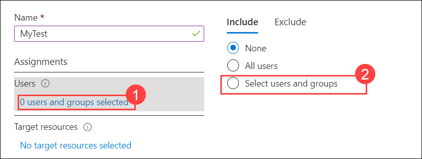
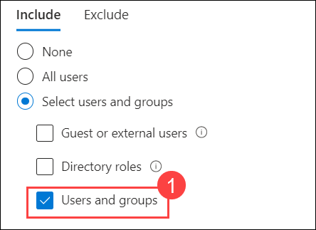
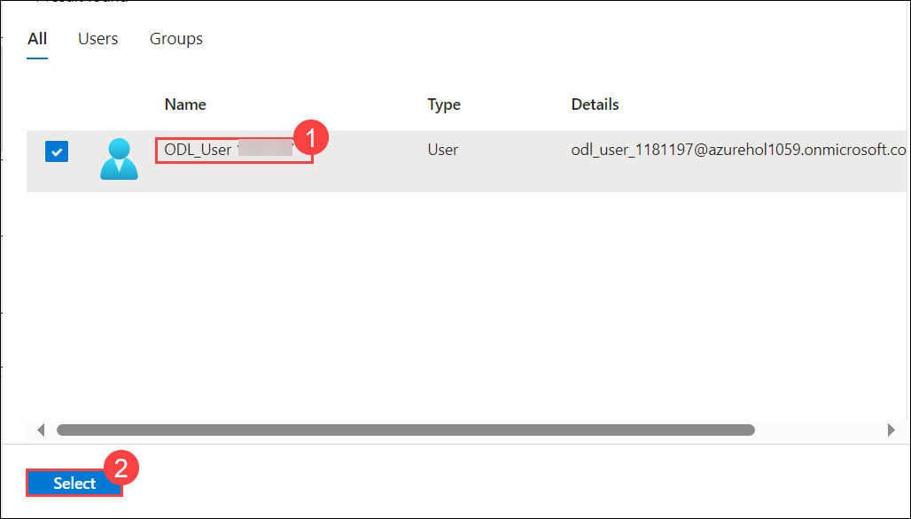
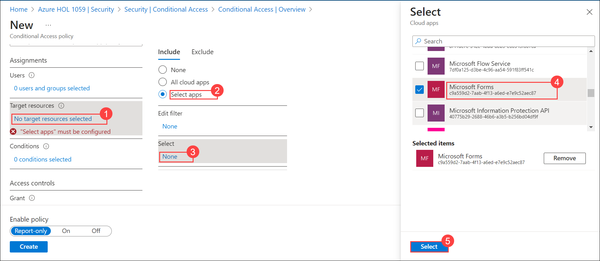
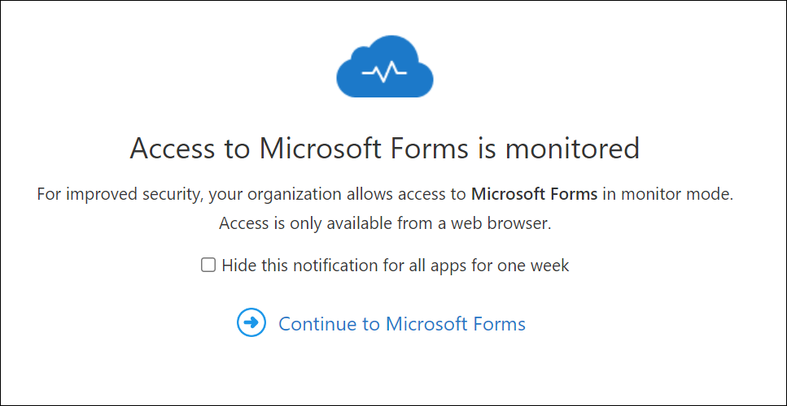
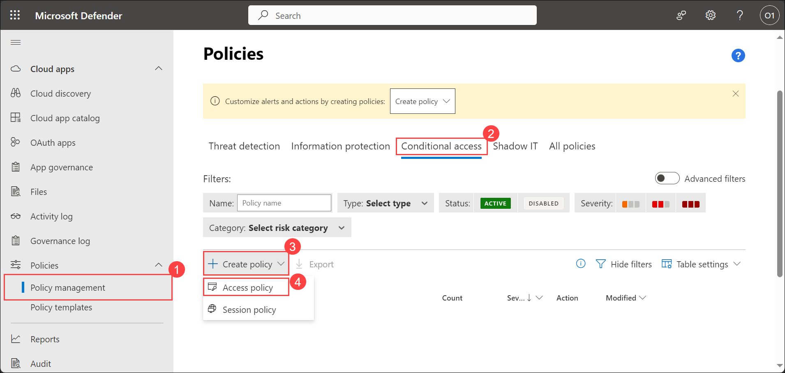
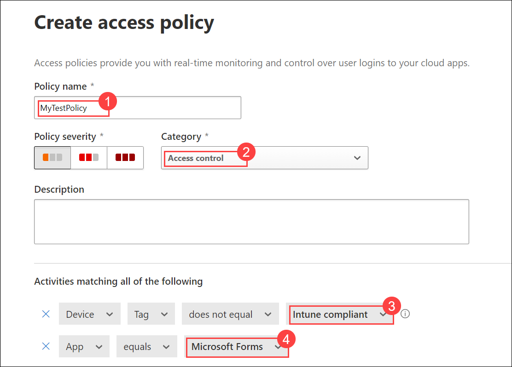

## Lab 10 - Configure App Access Policies 

## Lab scenario

In this lab, we will delve into configuring App Access Policies within the Microsoft 365 Defender suite. The scenario aims to enhance setting rules and controls to manage application access, enhancing an organization's security posture. The exercises include configuring integration with Microsoft Entra ID, creating App Access Policies, and reviewing the Activity Log in Defender for Cloud Apps. 

## Lab objectives (Duration:  minutes)

In this lab, you will complete the following tasks:

- Exercise 1: Configure integration with Microsoft Entra ID
- Exercise 2: Create App Access Policies
- Exercise 3: Review the Activity Log in Defender for Cloud Apps

## Architecture Diagram

   

### Exercise 1: Configure integration with Microsoft Entra ID

1. Navigate to Azure Portal, in **Search resources, services and docs** search and select for **Microsoft Entra ID**.

   

1. From the left-hand navigation pane, under **Manage**, select **Security**.

1. From the left-hand navigation pane, under **Protect**, select **Conditional Access**.

1. Select **+ Create new policy**.

1. Enter a policy name, **MyTest**.

1. Under **Users**, select **0 users and groups selected**, under **Include**, select **Select users and groups**.

   

1. select **Users and groups**.
Choose your user account for the lab tenant and select **Select**.

   
   

1. Under Target resources, select **No target resources selected**, under **Include**, select **Select apps**, under **Select** choose **None**, and then choose **Microsoft Forms**, and select **Select**.

   

1.  Under **Access controls**, under **Session**, select **0 controls selected**. Select the **Use Conditional Access App Control** box, select the drop-down and select **Monitor only (Preview)**, and select **Select**.

    

1. Under **Enable policy**, select **On**, and select **Create**.

   >**Note**: Before proceeding, make sure to first sign out of existing sessions.

1. Launch a new InPrivate browsing window, and browse to https://forms.microsoft.com.

1. Select Sign in and log in them.

1. Confirm that you get a new message as shown below:

    - Access to Microsoft Forms is monitored.

   

1. Close the InPrivate browsing window.

## Exercise 2 - Create App Access Policies

1. Launch a new InPrivate browsing window, and browse to https://www.security.microsoft.com/.

1. In the Microsoft Defender Portal, under **Cloud Apps**, go to **Policies -> Policy management**. Then select the **Conditional access** tab.

1. Select **Create policy** and then select **Access policy**.

   

1. Enter a name for the policy, **MyTestPolicy**.

1. Leave the **Category** as **Access control**.

1. **Under Activities matching all of the following**, select the drop-down for **Intune compliant**, **Hybrid Azure AD joined** and unselect **Hybrid Azure AD joined**.

   

1. Select the drop-down for Select apps, select **Microsoft 365**.

1. Leave **Actions** as **Test**.

1. Under **Alerts**, leave **Create an alert**... checked and select **Send alert as email** and enter your mail id.

1. Enter and select.

1. Select **Create** to create the access policy.

## Exercise 3 - Review the Activity Log in Defender for Cloud Apps

1. Return to the browser running Microsoft 365 Defender.

2. Refresh the browser to ensure the most recent data is downloaded.

3. From the left-hand navigation pane, under **Cloud apps**, select **Activity log**.

4. Using the **App: filter** pick **Microsoft Forms** from the list.

5. Notice the sign-on records.

   

### Review

In this lab, you will complete the following tasks:

- Configure integration with Microsoft Entra ID
- Create App Access Policies
- Review the Activity Log in Defender for Cloud Apps

