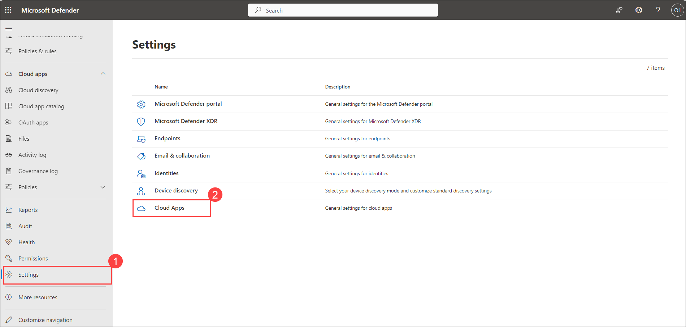
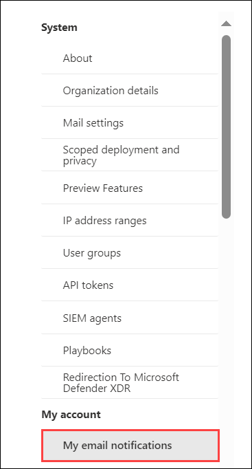
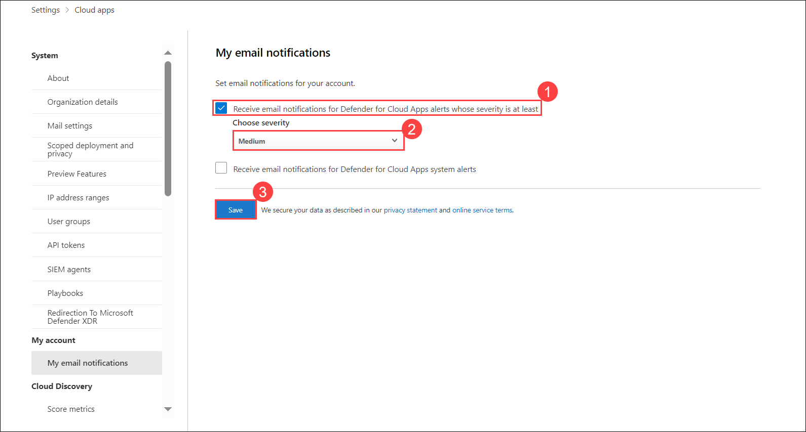
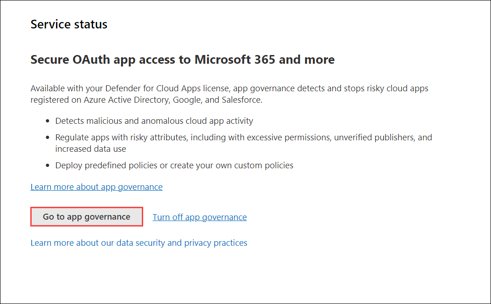
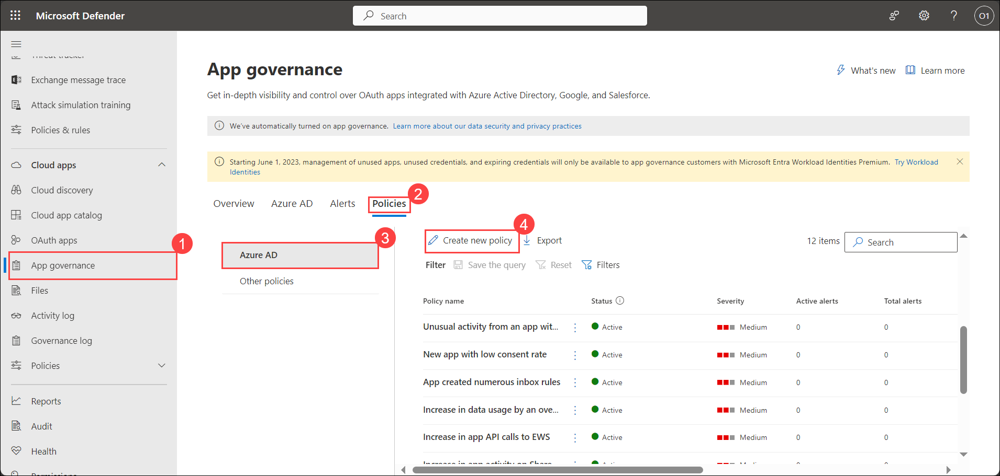

## Lab 11 - Setup Alerts & App Governance 

## Lab scenario

In this lab, we will configure alert notifications in Microsoft Defender to manage potential threats, setting up email alerts for different severity levels. Simultaneously, we will establish App Governance within Microsoft 365 Security, activating governance frameworks and creating OAuth app policies to regulate data usage for specific Azure AD apps. This lab equips admins to proactively monitor and respond to alerts while enforcing robust governance for secure and compliant app utilization.

## Lab objectives (Duration: minutes)

In this lab, you will complete the following tasks:
- Exercise 1: Configure alert notifications in Microsoft Defender for Cloud Apps 
- Exercise 2: Setup App Governance  

## Architecture Diagram

### Exercise 1: Configure alert notifications in Microsoft Defender for Cloud Apps

Setting up alerts in Microsoft Defender for Cloud Apps involves configuring policies to detect and notify about specific activities or security incidents within your cloud environment. These policies, tailored to your organization's needs, enable you to define conditions triggering alerts, specify alert severity levels, and choose notification channels.

1. In the Microsoft Defender Portal, select **Settings**. Then choose **Cloud Apps**.

   

2. Under My account, select **My email notifications**.

   

3. In the My email notifications page, select the checkbox for **Receive email notifications for defender for Cloud Apps alerts whose severity is at least** and under **Choose Severity** click on the dropdown button and select **Medium**. Click on **Save**.

   

### Exercise 2: Setup App Governance  

App Governance in Microsoft Defender for Cloud Apps empowers organizations to manage and regulate the usage of applications within their cloud environment. This functionality enables administrators to establish policies, controls, and compliance measures to oversee app activities. With App Governance, admins can enforce specific access policies, monitor app behavior for compliance violations, and implement measures to mitigate risks associated with app usage. This capability provides granular control and helps ensure that cloud applications align with security standards and organizational policies.

#### Task 1: Turn on app governance

1. Go to https://security.microsoft.com/ > Settings > Cloud Apps > App governance

   

2. Select **Service status** under App governance. Select **Turn on app governance**.

   

3. Click on **Go to App governance**.

    
   
   >**Note**: Once App governance is on. Sign in again to start using it.   
   >**Note**: You'll need to wait up to 10 hours to see and use the product.

3. After getting, the app governance provisioned You will see the app governance page. In the Privacy consent required tab. Select **Accept**.

   

#### Task 2: Create OAuth app policies for Microsoft Entra ID

1. To create a new app policy for Azure AD apps, go to Microsoft Defender XDR > App governance > Policies > Azure AD > Create new policy.

   

2. To create a custom policy, select the **Custom** category. Under Template select **Custom Policy**. Select **Next**.

   

3. Provide the details and Click **Next**.
- Policy name: Custom Policy <inject key="DeploymentID" enableCopy="false" /></inject>
- Description: Custom Policy <inject key="DeploymentID" enableCopy="false" /></inject>
- Severity: Low

   

4. Under Set policy scope and conditions tab select **No, I'll customize the policy**.

   

5. Under Set policy scope and conditions. Select Specific Apps and from Choose apps select the application **cpvclodlabsacademy**. Click **Add(1)**.

   

6. In Apply default conditions from the template? Select **No, I'll edit the conditions** and Select **Edit conditions**.

   

7. Under Edit policy conditions. Select **Add condition** and select **Data usage** and select **Save** and then select **Next**.

   

8. Under Set policy action select the check-box next to **Disable app** and select **Next**.

   

9. Under Set policy status select **Active** and select **Next**.

   

10. Under review your policy select **Submit** and select **Done**.

    

## Review
In this lab, you will complete the following tasks:
- Configure alert notifications in Microsoft Defender for Cloud Apps 
- Setup App Governance
