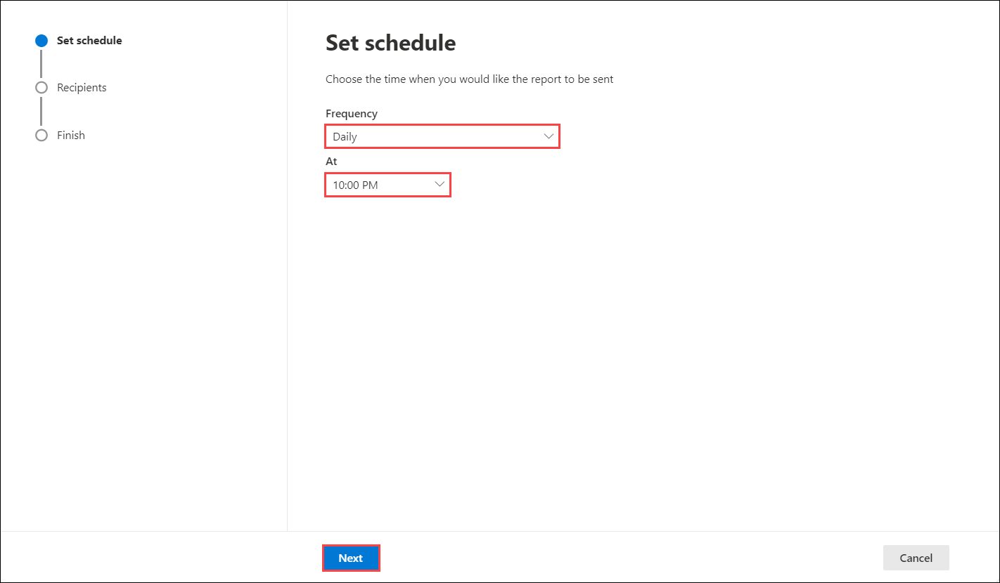
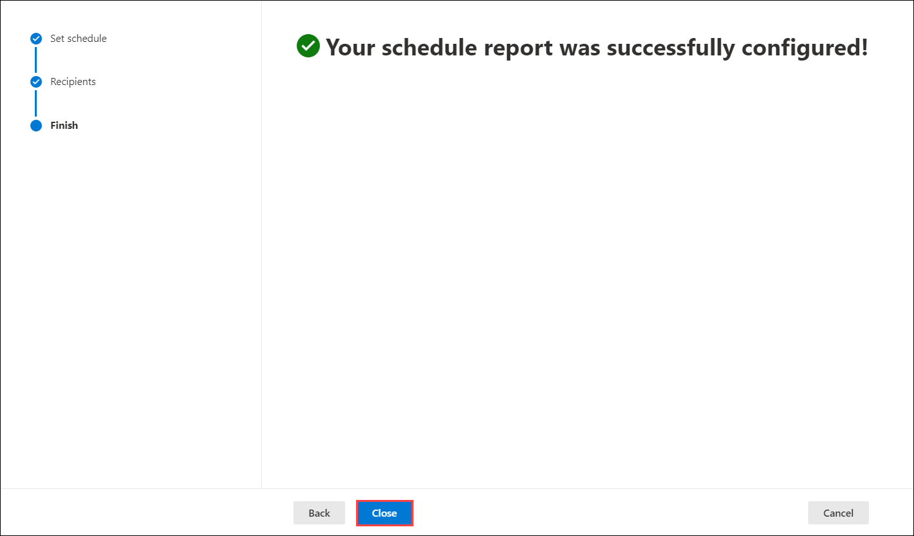

## Lab 15 - Download and schedule defender for identity reports 

## Lab scenario

In this lab, you will leverage Microsoft Defender XDR to manage Defender for Identity reports efficiently. They access these reports and download specific reports containing a maximum of 100,000 rows for analysis. Additionally, you can schedule report delivery via email by defining conditions, specifying the delivery time, and adding recipient email addresses. This streamlines report access and enables automated delivery, facilitating enhanced security monitoring and information sharing.

## Lab objectives (Duration: 20 minutes)

In this lab, you will complete the following tasks:
- Exercise 1: Access Defender for Identity reports
- Exercise 2: Schedule a report by email

## Architecture Diagram

   

### Exercise 1: Access Defender for Identity reports

Accessing Defender for Identity reports involves navigating through the Microsoft Defender XDR platform to the designated section for these reports. Users select specific reports of interest from the available options and proceed to download them. These reports, can be accessed via the browser, providing valuable insights and detailed information regarding identity-related activities within the network for analysis or record-keeping purposes.

1. In Microsoft Defender XDR, select **Reports > Identities > Report management**.

   

2. On the Identities reports page, select a report and then select **Download**.

   

>**Note**: Your report is downloaded by your browser, where you can open or save it. Downloaded reports include a maximum of 100,000 rows.

### Exercise 2: Schedule a report by email

Scheduling a report by email for Identity reports within Microsoft Defender XDR allows users to automate report delivery to designated recipients. Users configure the schedule, defining conditions and specifying delivery times within the Defender XDR interface. This feature streamlines information sharing and enhances collaboration by ensuring timely delivery of vital identity-related insights and data to relevant stakeholders.

1. In Microsoft Defender XDR, select **Reports > Identities > Report management**.

   

2. On the Identities reports page, select a report and then select **Schedule report**.

   

3. On the Set schedule page, define the conditions in which you want to send the report, and the time you want it sent.

   

>**Note**: Your report is sent according to your Microsoft Defender XDR time zone settings (Local or UTC).

4. On the Recipients page, enter and add email addresses for anyone you want to receive the report. Select Next to complete the scheduling.

   

5. The Finish page shows a confirmation message. Select Close to close the wizard.

   

## Review
In this lab, you will complete the following tasks:
- Accessed Defender for Identity reports
- Scheduled a report by email
